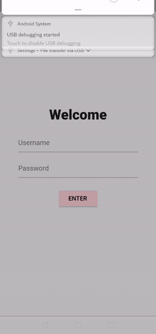

# catalog_app_provider

A flutter application to demonstrate how to use the provider package for state management

## Goals
Building an application to demonstrate how to use the [flutter provider package](https://pub.dev/packages/provider) to share the current state of a widget between screens.

Provide code for the example used in the [simple app state management docs](https://flutter.dev/docs/development/data-and-backend/state-mgmt/simple)

Widgets used
  - login widget
  - catalog widget (home screen)
  - cart widget
  
Result

